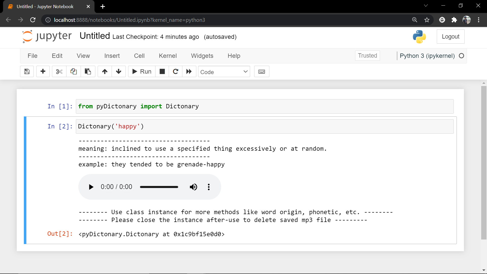

## Or if you are like me who just obsessed with jupyter notebook and don't use terminal at all then this script is for you

### Just import the pyDictonary by given code and start using the dictonary right away

```python
from pyDictonary import Dictonary

Dictonary('happy')
```
```
>>> ------------------------------------
>>> meaning: inclined to use a specified thing excessively or at random.
>>> ------------------------------------
>>> example: they tended to be grenade-happy
```


## TO-DO
- return print statement when user doesn't specify word and run the class empty
- Play the audio without downloading it
- Have the method which gives more definations and examples
